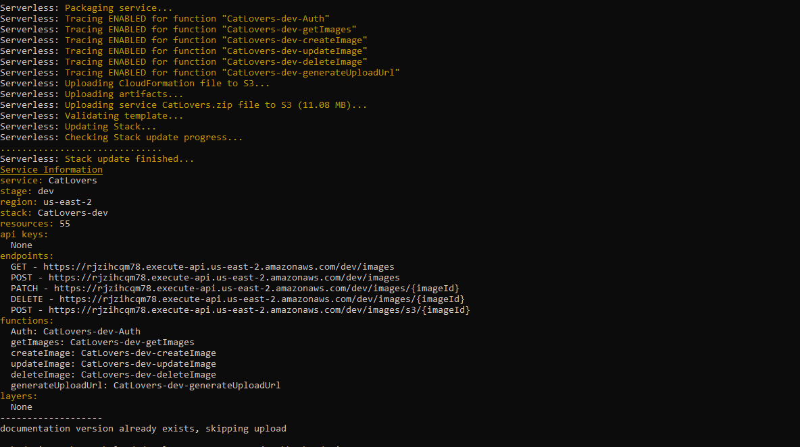
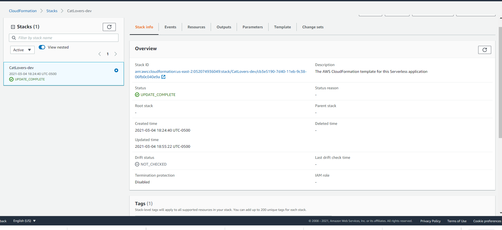
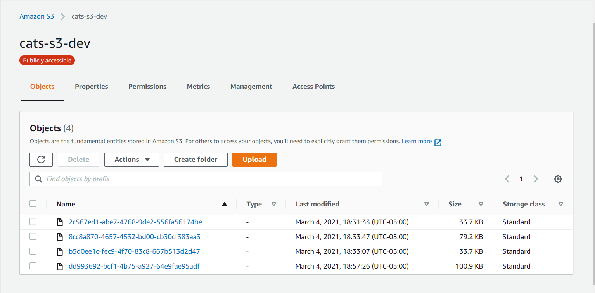
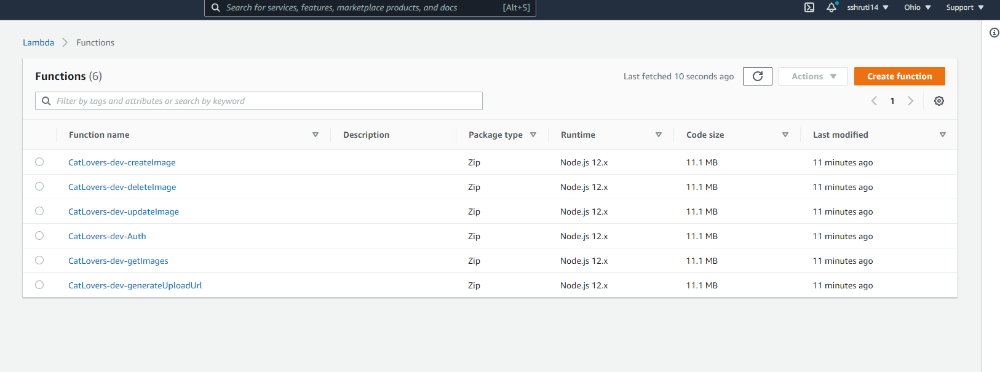
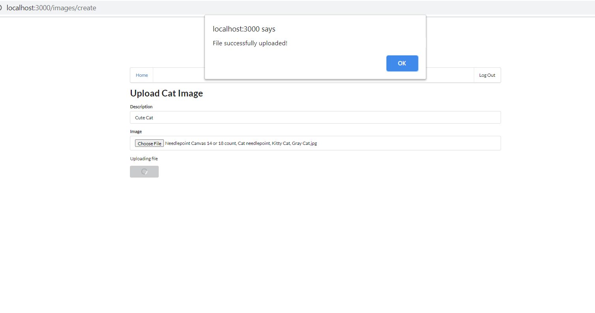
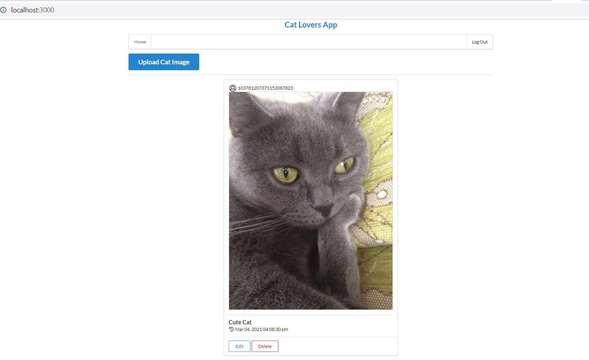

# Udacity Cloud Developer Nanodegree Capstone Project

I developed an image uploading app for cats called "Cat Lovers App". This app caters for cat lovers who can upload cute images of cats.The technology used in developing this app is as follows:

### AWS Services 
   
   - Lambdas for storing functions
   - DynamoDB
   - Api Gateway (front-door securing, monitoring...the REST API)
   - S3 Bucket (storage of images)
   - CloudFormation (infrastructure as code, provisioning a collection of needed resources)
   - IAM user
   - XRay 
   
### Serverless Framework 

### Frontend client
   - ReactJS
   
### Auth0
   - OAuth integration for 3rd party apps
   - RS256 Algorithm

### Few Optimisations added
   - Global Secondary Indexes on DynamoDB
   - Xray for debugging logs 
   

# Getting started:

### Installation
   Use the node package manager to install Cat Lovers App
   
       cd backend
       npm install

       cd ../frontend
       npm install
      
### To start the client in localhost

- Update client/src/config.ts credentials to match your Auth0 account and 
- Serverless deployment 

The client can be installed and run locally in http://localhost:3000/

       cd client
       npm run start

# Screenshots

### Serveless deployment:

### CloudFormation:

### s3 buckets:

### AWS lambdas:

# Successful upload message:

